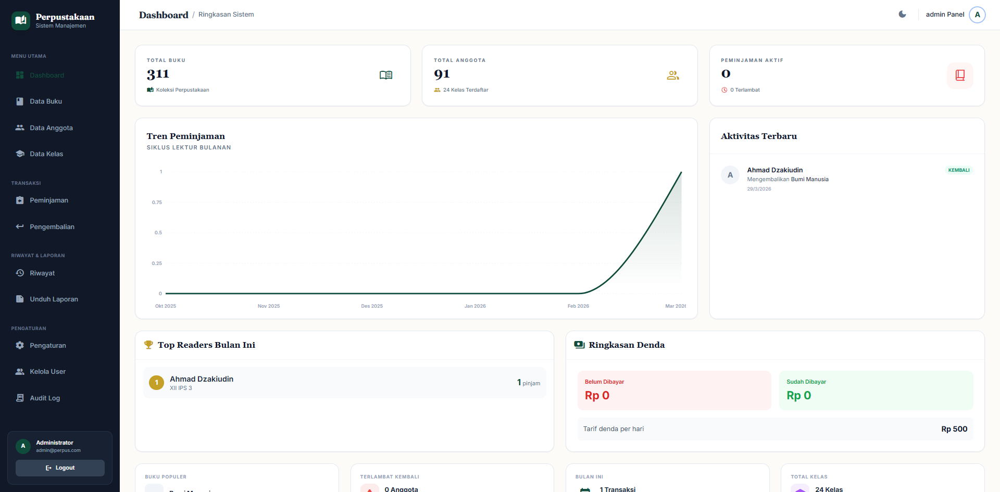
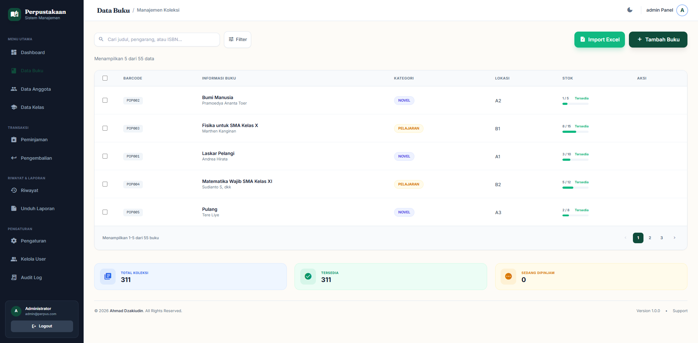
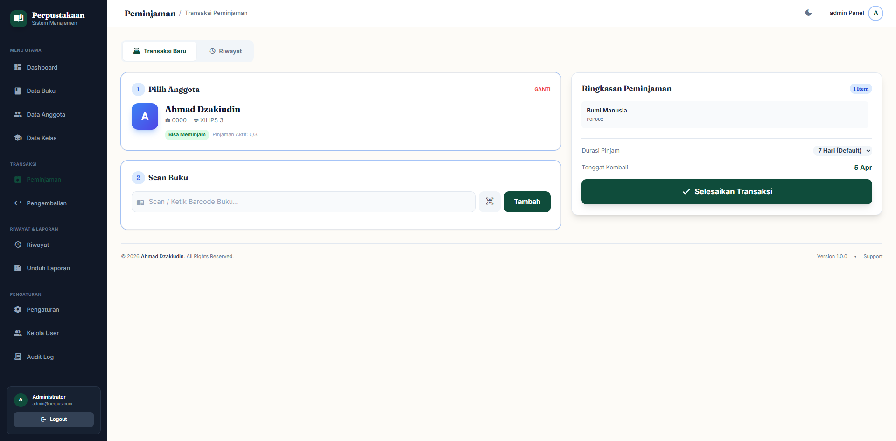

# Perpustakaan Informasi APP 📚

Sistem Manajemen Perpustakaan Sekolah yang modern, cepat, dan mudah digunakan.  
Dibangun dengan arsitektur **monorepo** menggunakan **React** (Frontend) dan **Node.js + Express** (Backend).

---

## 📸 Tampilan Aplikasi

Berikut adalah pratinjau antarmuka (*mockup*) dari aplikasi Perpustakaan Informasi:

### 1. Dashboard Utama
Menampilkan statistik ringkas perpustakaan, tingkat peminjaman, dan aktivitas terbaru.


### 2. Manajemen Buku & Koleksi
Daftar buku dengan fitur pencarian, filter kategori, status ketersediaan, dan *ISBN lookup*.


### 3. Transaksi Peminjaman
Proses pinjam meminjam terpadu, mendukung pencarian anggota dan *scan Barcode / QR Code*.


*(Tampilan di atas merupakan ilustrasi desain modern. Screenshot asli dapat diupdate dengan menimpa file di dalam direktori `docs/images/`)*

---

## 🚀 Fitur Utama

- **Dashboard** — Statistik ringkas perpustakaan secara real-time.
- **Manajemen Buku** — CRUD buku lengkap dengan ISBN lookup, barcode, dan tracking lokasi rak.
- **Manajemen Anggota** — Data siswa/guru yang terintegrasi dengan kelas.
- **Transaksi Peminjaman** — Proses pinjam & kembali dengan scan QR Code/Barcode.
- **Reservasi Buku** — Sistem antrian reservasi untuk buku yang sedang dipinjam.
- **Laporan Otomatis** — Generate laporan dalam format Excel dan PDF.
- **Manajemen User** — Role-based access (Admin & Pustakawan).
- **Audit Log** — Pencatatan semua aktivitas pengguna.
- **Dokumentasi API** — Terintegrasi dengan Swagger UI.
- **Responsive Design** — Akses via HP, tablet, atau PC.

---

## 🛠️ Tech Stack

### Frontend
| Teknologi | Kegunaan |
|-----------|----------|
| React 18 + Vite | Framework & build tool |
| TypeScript | Type safety |
| Tailwind CSS | Styling |
| React Router DOM | Routing |
| Recharts | Visualisasi data chart |
| Axios | HTTP Client |
| JsPDF | Generate laporan PDF |
| html5-qrcode | Scanner QR/Barcode |

### Backend
| Teknologi | Kegunaan |
|-----------|----------|
| Node.js + Express | Runtime & framework |
| TypeScript | Type safety |
| Prisma ORM | Database access |
| SQLite | Database (ringan, tanpa setup server) |
| JWT + BcryptJS | Authentication & hashing |
| Winston | Logging |
| Multer | File upload |
| Swagger | API documentation |
| PDFKit + ExcelJS | Generate laporan |
| Nodemailer | Notifikasi email |
| bwip-js + qrcode | Barcode & QR generator |

---

## 📋 Prasyarat

Pastikan perangkat sudah terinstal:

1. **Node.js** v18+ — [Download](https://nodejs.org/)
2. **Git** — [Download](https://git-scm.com/)

> **Catatan:** Aplikasi ini menggunakan **SQLite**, sehingga tidak perlu install database server seperti PostgreSQL/MySQL.

---

## 🚀 Instalasi & Setup

### 1. Clone Repository

```bash
git clone https://github.com/Dzakiudin/Perpusstakaan-Informasi-APP.git
cd Perpusstakaan-Informasi-APP
```

### 2. Install Dependencies

```bash
npm run install:all
```

### 3. Konfigurasi Environment

```bash
cp backend/.env.example backend/.env
```

Edit file `backend/.env` dan sesuaikan konfigurasi:

```env
DATABASE_URL="file:./dev.db"
JWT_SECRET="ganti-dengan-secret-key-anda"
PORT=3001

# Konfigurasi email (opsional)
SMTP_HOST="smtp.gmail.com"
SMTP_PORT=465
SMTP_USER="email-anda@gmail.com"
SMTP_PASS="app-password-anda"
```

### 4. Setup Database

```bash
cd backend
npx prisma migrate dev --name init
npx prisma db seed
cd ..
```

---

## 🏃 Cara Menjalankan

Buka **2 terminal** terpisah:

**Terminal 1 — Backend:**
```bash
npm run dev:backend
```

**Terminal 2 — Frontend:**
```bash
npm run dev:frontend
```

Aplikasi akan berjalan di:
- **Frontend:** `http://localhost:5173`
- **Backend API:** `http://localhost:3001`

### Default Login

| Role | Email | Password |
|------|-------|----------|
| Admin | `admin@perpus.com` | `admin123` |
| Pustakawan | `pustakawan@perpus.com` | `pustakawan123` |

---

## 📖 Dokumentasi API

Akses Swagger UI saat backend berjalan:

```
http://localhost:3001/api-docs
```

---

## 📁 Struktur Project

```
perpus/
├── frontend/             # React + Vite (UI)
│   ├── src/
│   │   ├── components/   # Komponen reusable
│   │   ├── pages/        # Halaman aplikasi
│   │   ├── services/     # API client
│   │   └── App.tsx       # Root component
│   └── package.json
├── backend/              # Node.js + Express (API)
│   ├── src/
│   │   ├── controllers/  # Request handlers
│   │   ├── routes/       # API routes
│   │   ├── services/     # Business logic
│   │   ├── middleware/   # Auth middleware
│   │   ├── utils/        # Logger, swagger, dll
│   │   └── app.ts        # Entry point
│   ├── prisma/
│   │   ├── schema.prisma # Database schema
│   │   └── seed.ts       # Data awal
│   └── package.json
├── database_guide.md     # Panduan pengelolaan database
├── package.json          # Root monorepo config
└── README.md
```

---

## 🗃️ Pengelolaan Database

Lihat [`database_guide.md`](./database_guide.md) untuk panduan lengkap:

- Akses database via **DB Browser for SQLite** (tanpa terminal)
- Kelola data visual via **Prisma Studio** (`npx prisma studio`)
- Isi data awal via **seeding** (`npm run db:seed`)
- Update struktur via **migration** (`npx prisma migrate dev`)

---

## 📝 NPM Scripts

| Command | Keterangan |
|---------|-----------|
| `npm run install:all` | Install semua dependencies |
| `npm run dev:frontend` | Jalankan frontend (dev mode) |
| `npm run dev:backend` | Jalankan backend (dev mode) |
| `npm run build` | Build semua workspaces |
| `npm run test` | Jalankan semua test |

### Backend-specific Scripts

| Command | Keterangan |
|---------|-----------|
| `npm run db:migrate -w backend` | Jalankan database migration |
| `npm run db:seed -w backend` | Seed data awal |
| `npm run db:reset -w backend` | Reset database |
| `npm run test -w backend` | Jalankan unit test |

---

## 📄 Lisensi & Hak Cipta

© 2026 **Ahmad Dzakiudin**. All Rights Reserved.

Seluruh informasi dan konsep teknis yang terkandung dalam project ini adalah hak milik intelektual Ahmad Dzakiudin. Dilarang keras menyebarluaskan atau mereproduksi materi ini tanpa izin tertulis dari pemilik.
